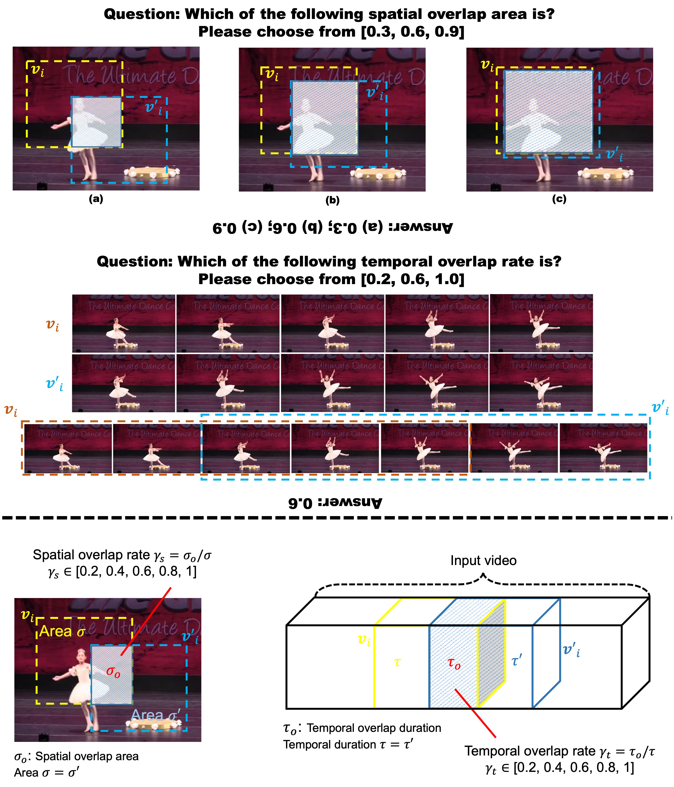
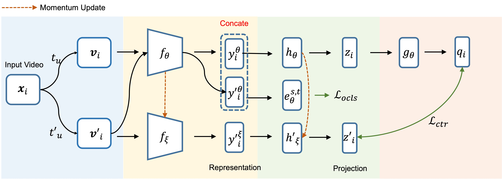

# Contrastive Spatio-Temporal Pretext Learning for Self-supervised Video Representation

This repository is an official pytorch implementation of CSTP work:

**[Contrastive Spatio-Temporal Pretext Learning for Self-supervised Video Representation](https://arxiv.org/abs/2112.08913)**, AAAI, 2022

*Yujia Zhang, Lai-Man Po, Xuyuan Xu, Mengyang Liu, Yexin Wang, Weifeng Ou, Yuzhi Zhao, Wing-Yin Yu*

## Motivation
- Considering the intermediate of contrastive learning, we propose a novel pretext task - spatio-temporal overlap rate prediction


- Using playback rate prediciton and rotation prediction to further enhance temporal and spatial representation, respectively.



## Requirements

### Installation
- Python3
- pytorch1.1+
- PIL
- [Decord](https://github.com/dmlc/decord)
- lmdb
- msgpack
- ffmpeg


### Datasets
Please follow the instructions in [DATASET.md](data_process/DATASET.md) for dataset preparation.

## Pre-trained models

## Pre-train/finetune/test in CSTP
### Pre-train instruction
- pre-train on Kinetics
```
CUDA_VISIBLE_DEVICES=0,1,2,3,4,5,6,7 /data/miniconda3/bin/python -m torch.distributed.launch \
--nproc_per_node=8 --master_port 11190 main_byol.py --dataset Kin400RepreLMDB --split 1 \
--n_classes 101 --batch_size 128 --sample_duration 16 \
--model_name r21d_byol --model_depth 1 --ft_begin_index 0 \
--lmdb_path "/dockerdata/yujiazhang/dataset/frame_kinetics_400_mmlab_1f_320_lmdb/lmdb_kin400.lmdb" \
--annotation_path "data_process/kin400_mmlab_labels" \
--result_path "results_kin400_r21d_bsor_rotaug_bs128_lr3e2_wd5e4_bvsvtvp0.1v1v1v1v1v1_mlp_proj_epoch300" \
--n_epochs 300 --learning_rate 0.09 --weight_decay 5e-4 \
--sample_size 112 --n_workers 6 --task loss_com --optimizer sgd --loss_weight 0.1 1 1 1 1
```

- pre-train on UCF-101
```
CUDA_VISIBLE_DEVICES=0,1,2,3,4,5 /data/miniconda3/bin/python -m torch.distributed.launch \
--nproc_per_node=6 --master_port 19110 main_byol.py --dataset UcfRepreBYOLSpPre --split 1 \
--n_classes 101 --batch_size 60 --sample_duration 16 \
--model_name r21d_byol --model_depth 1 --ft_begin_index 0 \
--frame_dir "/dockerdata/yujiazhang/dataset/UCF_101_1f_256" \
--annotation_path "data_process/UCF101_labels" \
--result_path "results_ucf_r21d_bsor_bs60_lr3e2_wd5e4_bvsvtvp0.1v1v1v1v1_twospd_mlp_proj" \
--n_epochs 300 --learning_rate 0.03 --weight_decay 5e-4 \
--sample_size 112 --n_workers 6 --task loss_com --optimizer sgd --loss_weight 0.1 1 1 1 1
```

### Finetune instruction
- Finetune on UCF-101
```
CUDA_VISIBLE_DEVICES=0,1 /data/miniconda3/bin/python -m torch.distributed.launch \
--nproc_per_node=2 --master_port 16110 main_ft_mp.py --dataset UcfFineTune --split 1 \
--n_classes 101 --n_finetune_classes 101 --batch_size 60 --sample_duration 16 \
--model_name r21d_byol --model_depth 1 \
--frame_dir "/dockerdata/yujiazhang/dataset/UCF_101_1f_256" \
--annotation_path "data_process/UCF101_labels" \
--result_path "results_ucf_r21d_bsor_bs60_lr3e2_wd5e4_bvsvtvp0.1v1v1v1v1_twospd_mlp_proj" \
--pretrained_path "results_ucf_r21d_bsor_bs60_lr3e2_wd5e4_bvsvtvp0.1v1v1v1v1_twospd_mlp_proj/UcfRepreBYOLSpPre/loss_com/save_300.pth" \
--n_epochs 100 --learning_rate 0.025 --weight_decay 5e-4 \
--sample_size 112 --n_workers 6 --task "ft_all" --optimizer sgd --transform_mode "img" \
--pb_rate 4
```

### Test instruction
```
CUDA_VISIBLE_DEVICES=0 /data/miniconda3/bin/python test.py --dataset UcfFineTune --split 1 \
--n_classes 101 --n_finetune_classes 101 \
--batch_size 1 --sample_duration 16 \
--model_name r21d_byol --model_depth 1 --ft_begin_index 5 \
--frame_dir "/dockerdata/yujiazhang/dataset/UCF_101_1f_256" \
--annotation_path "data_process/UCF101_labels" \
--result_path "results_ucf_r21d_bsor_bs60_lr3e2_wd5e4_bvsvtvp0.1v1v1v1v1_twospd_mlp_proj" \
--sample_size 112 --n_workers 6 --task "test" --pb_rate 4 --transform_mode "img_test" --t_ft_task "ft_all"
```

## License

The majority of this work is licensed under [CC-NC 4.0 International license](LICENSE).


## Cite

If you find this repository useful in your own research, please consider citing:

```BibTeX
@article{zhang2021contrastive,
  title={Contrastive Spatio-Temporal Pretext Learning for Self-supervised Video Representation},
  author={Zhang, Yujia and Po, Lai-Man and Xu, Xuyuan and Liu, Mengyang and Wang, Yexin and Ou, Weifeng and Zhao, Yuzhi and Yu, Wing-Yin},
  journal={arXiv preprint arXiv:2112.08913},
  year={2021}
}
```
